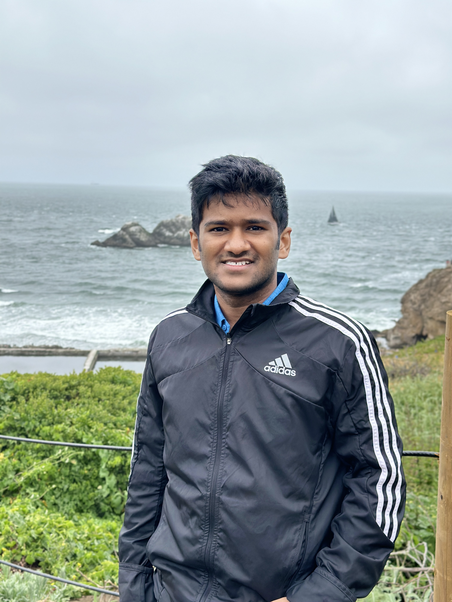

<!-- ════════════════════════════════
     HERO
════════════════════════════════ -->

  

    
Structural Analysis Engineer &nbsp;|&nbsp; FEA &nbsp;|&nbsp; Scripting &amp; Optimization &nbsp;|&nbsp; Multiphysics Simulation

    <h1>Shishir Barai</h1>
    

      Ph.D. in Engineering Science & Mechanics (Penn State). Specialized in finite element analysis, automated simulation workflows, and Python-based scripting for multiphysics modeling. Currently at X-energy; previously interned at ASML and Ansys.
    

    

      <a href="Resume_Barai_Shishir.pdf" class="btn-primary">⬇ Resume</a>
      <a href="https://www.linkedin.com/in/shishir-barai/" class="btn-outline" target="_blank">LinkedIn</a>
      <a href="https://scholar.google.com/citations?user=L8pNussAAAAJ" class="btn-outline" target="_blank">Scholar</a>
    

  

  

    
  

<!-- ════════════════════════════════
     CORE SKILLS
════════════════════════════════ -->

  
Core Expertise

  

    

      <h4>FEA & Simulation</h4>
      
Abaqus CAE, ANSYS, COMSOL, LS-DYNA

    

    

      <h4>Scripting & Automation</h4>
      
Python, PyAnsys, MAPDL, Matlab, C++

    

    

      <h4>Optimization & DOE</h4>
      
Ansys optiSLang, Parametric Modeling, Design of Experiments (DOE)

    

    

      <h4>ML for Simulation</h4>
      
CNNs, Autoencoders, TensorFlow, PyTorch, Scikit-learn, Numpy, Pandas

    

    

      <h4>CAD & Modeling</h4>
      
SolidWorks, AutoCAD

    

    

      <h4>Materials Modeling</h4>
      
Hyperelastic (Mooney-Rivlin, Ogden), RVE Analysis

    

  

<!-- ════════════════════════════════
     EDUCATION
════════════════════════════════ -->

  
Education

  

    

      
Ph.D. — Engineering Science &amp; Mechanics

      
Pennsylvania State University, PA

    

    
2026

  

  

    

      
M.S. — Mechanical Engineering

      
University of Texas Rio Grande Valley, TX

    

    
2021

  

  

    

      
B.S. — Mechanical Engineering

      
Bangladesh University of Engineering &amp; Technology (BUET)

    

    
2018

  

<!-- ════════════════════════════════
     INDUSTRY EXPERIENCE
════════════════════════════════ -->

  
Industry Experience

  

    

      

        
Structural Analysis Engineer

        
X-energy LLC

      

      
Mar 2026 – Present Rockville, MD

    

    <ul>
      <li>Structural and thermal analysis of advanced nuclear reactor components using FEA in Ansys.</li>
      <li>Python scripting for simulation automation and post-processing workflows.</li>
    </ul>
  

  

    

      

        
Finite Element Analysis Intern

        
ASML US, Inc.

      

      
May 2025 – Aug 2025 San Diego, CA

    

    <ul>
      <li>Built a fully automated parametric CAD-to-simulation pipeline in Abaqus with 40 geometric design variables for EUV nozzle design.</li>
      <li>Scripted meshing, boundary conditions, solver settings, and post-processing using Abaqus Python API.</li>
      <li>Integrated Ansys optiSLang for DOE sampling, parameter sweeps, and performance-driven optimization.</li>
      <li>Conducted steady-state dynamic simulations to evaluate pressure response and maximize droplet formation.</li>
      <li>Delivered a modular, reusable automation framework; significantly reducing manual CAD-simulation iteration time.</li>
    </ul>
  

  

    

      

        
Mechanical Engineering Intern — Material Modeling Team

        
Ansys Inc.

      

      
Jun 2024 – Aug 2024 Canonsburg, PA

    

    <ul>
      <li>Developed a modular Python class to automate nonlinear FEA simulations and material calibration workflows using PyAnsys MAPDL.</li>
      <li>Applied Periodic Boundary Conditions on RVEs to extract homogenized hyperelastic material properties (Mooney-Rivlin, Ogden).</li>
      <li>Integrated Ansys Material Library (AML) for stress-strain data calibration and parameter verification.</li>
      <li>Built a flexible configuration system for load types, solver settings, and material definitions.</li>
    </ul>
  

<!-- ════════════════════════════════
     RESEARCH & PROJECTS
════════════════════════════════ -->

  
Research &amp; Projects

  

    

      
FEA Framework for Composite Microstructure Modeling — Penn State

      

        Python
		Object-Oriented Programming (OOP) 
		MOOSE
        Gmsh
        
      

    

    <ul>
      <li>Developed a Python class to generate two-phase microstructures with randomized particle distributions.</li>
      <li>Implemented linear elasticity FEA in MOOSE covering uniaxial tension, biaxial tension, and compression.</li>
      <li>Captured full displacement field data as training datasets for reduced order surrogate models.</li>
    </ul>
  

  

    

      
ML-Accelerated Microstructure Response Prediction — Penn State

      

        TensorFlow
        CNN
        Autoencoder
        HPC/Slurm
      

    

    <ul>
      <li>Trained CNN-based model to directly map microstructure inputs to FEA displacement fields.</li>
      <li>Built a convolutional autoencoder to compress high-dimensional FEA datasets by <strong>94%</strong>.</li>
      <li>Surrogate model trained on compressed latent space reduced overall training time by <strong>75%</strong>.</li>
      <li>Optimized training pipeline on a Linux-based Slurm HPC cluster.</li>
    </ul>
  

  

    

      
Transient FEA of Thin Plates — Penn State

      

        COMSOL
        Weak Form PDE
        Verification
      

    

    <ul>
      <li>Conducted transient structural analysis of rectangular plates under impulsive loading in COMSOL Multiphysics.</li>
      <li>Implemented weak form PDE formulations; analyzed stress distributions and dynamic response.</li>
      <li>Verified FEM accuracy using Method of Manufactured Solutions against analytical solutions.</li>
    </ul>
  

<!-- ════════════════════════════════
     PUBLICATIONS
════════════════════════════════ -->

  
Selected Publications

  

    <strong>Shishir Barai</strong>, Feihong Liu, Manik Kumar, Christian Peco.
    "Neural network-driven framework for efficient microstructural modeling of particle-enriched composites."
    Materials Today Communications, 2025.
    <a href="https://www.sciencedirect.com/science/article/abs/pii/S2352492824032604" target="_blank">[Link]</a>
  

  

    M. Kumar, N. Upadhyay, <strong>Shishir Barai</strong>, W.F. Reinhart, C. Peco.
    "A Bio-lattice Deep Learning Framework for Modeling Discrete Biological Materials."
    Journal of the Mechanical Behavior of Biomedical Materials, 2025.
    <a href="https://www.sciencedirect.com/science/article/abs/pii/S1751616125000165" target="_blank">[Link]</a>
  

  

    Lorestani, Farnaz, et al.
    "A Highly Sensitive and Long-Term Stable Wearable Patch for Continuous Analysis of Biomarkers in Sweat."
    Advanced Functional Materials, 2023.
    <a href="https://advanced.onlinelibrary.wiley.com/doi/full/10.1002/adfm.202306117" target="_blank">[Link]</a>
  

  

    J. Sgarrella, W. Laplante, <strong>Shishir Barai</strong>, M. Kumar, Christian Peco.
    "Data-driven material-based encoding for swarm decentralized controllers."
    Submitted — Journal of Swarm and Evolutionary Computation, 2025.
  

<!-- ════════════════════════════════
     COLLABORATE
════════════════════════════════ -->

  

    

      <h3>Open to Collaborate</h3>
      

        Interested in applied FEA, automated simulation workflows, or ML-accelerated physics problems?
        I am always open to collaborating on research or industry projects at the intersection of
        finite element methods, python scripting, and computational mechanics.
      

    

    <a href="mailto:shishirbarai9975@gmail.com" class="btn-collab">Get in Touch</a>
  

  Shishir Barai &nbsp;·&nbsp; State College, PA &nbsp;·&nbsp;
  <a href="mailto:shishirbarai9975@gmail.com">shishirbarai9975@gmail.com</a> &nbsp;·&nbsp;
  <a href="https://www.linkedin.com/in/shishir-barai/" target="_blank">LinkedIn</a>

